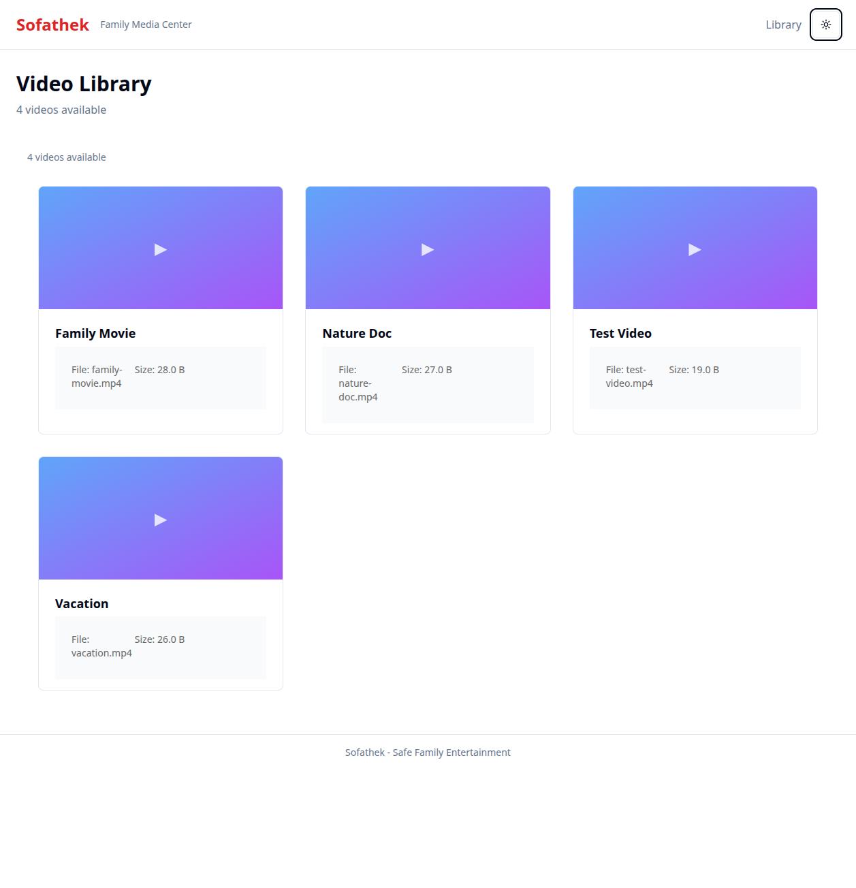
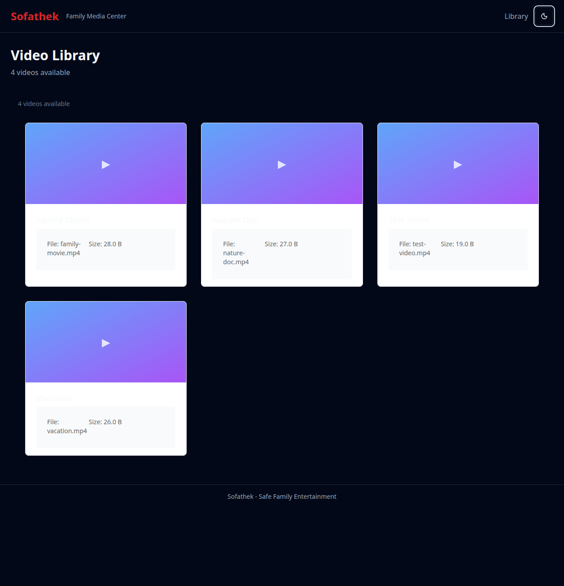
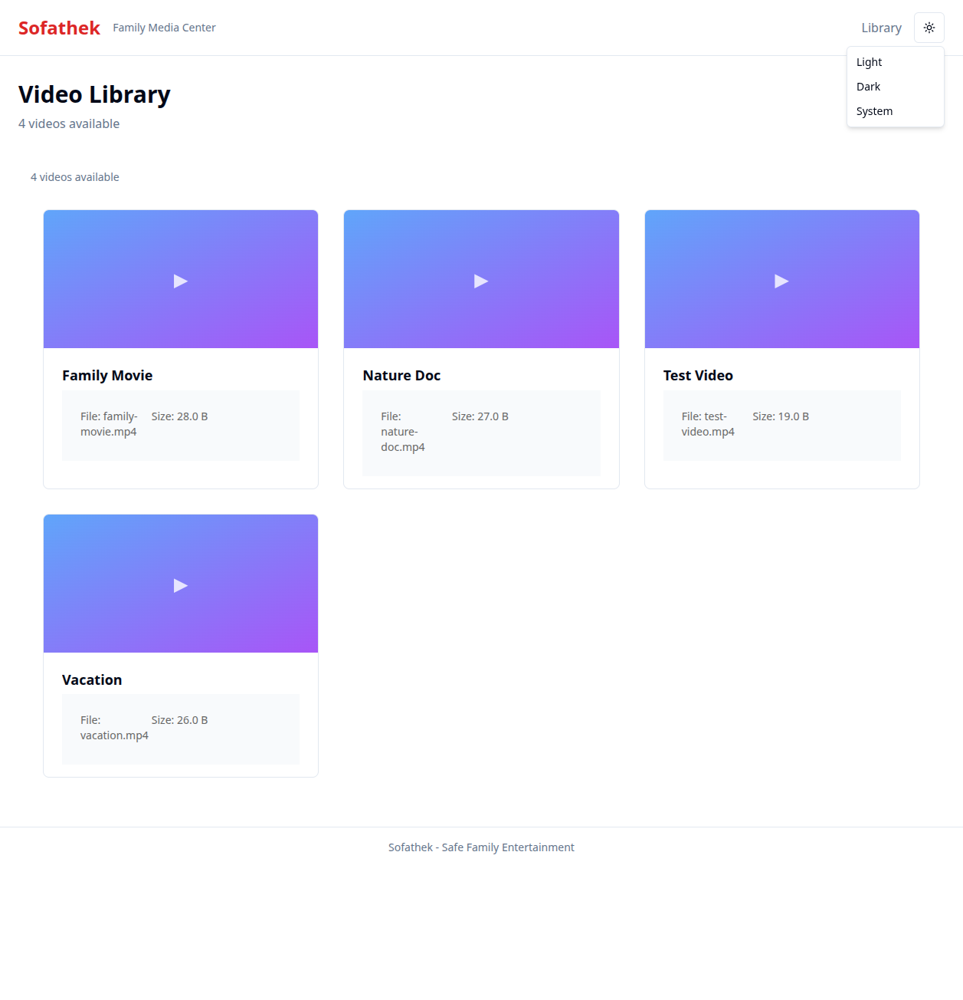
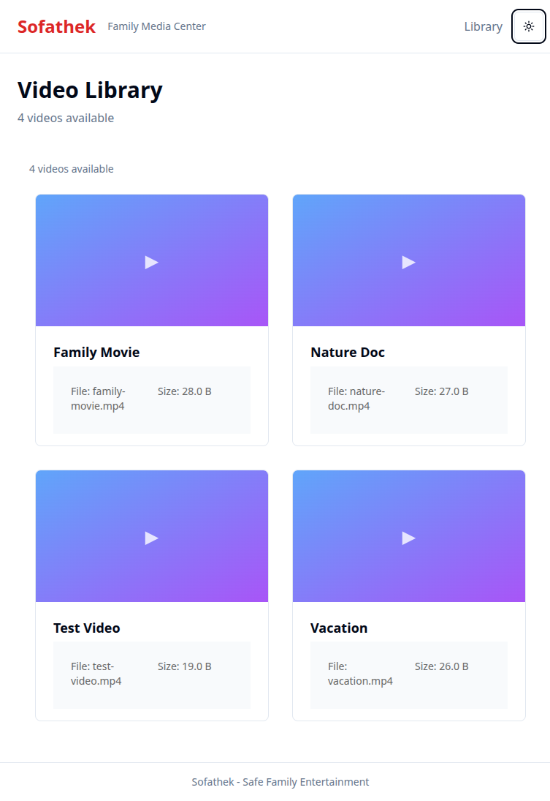
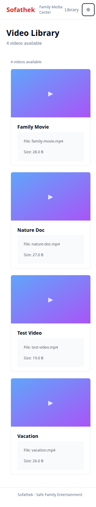
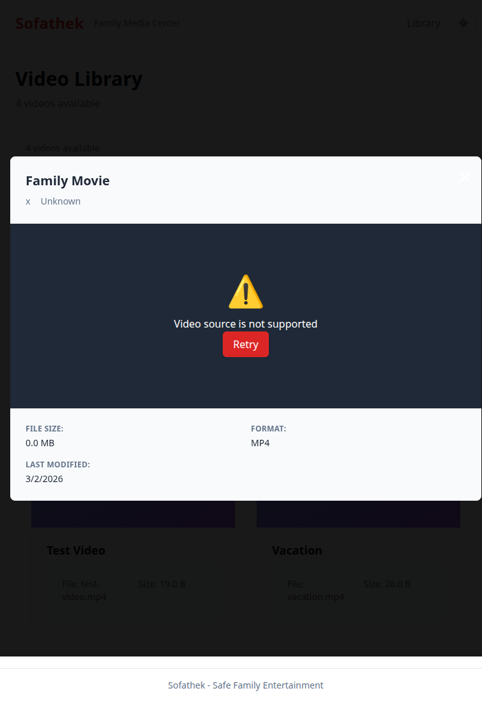
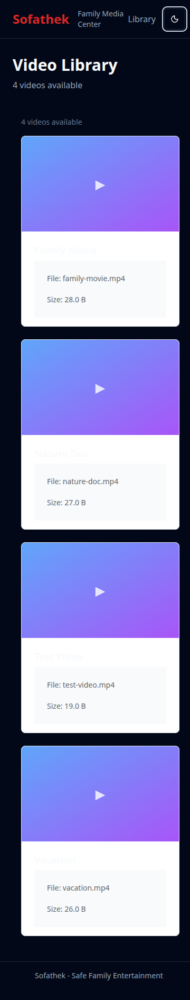

# Sofathek - Visual Gallery

## 🎯 Quick Visual Overview

### Desktop Experience
| Light Theme | Dark Theme | Theme Selector |
|-------------|------------|----------------|
|  |  |  |

### Multi-Device Responsive Design
| Desktop (1920px) | Tablet (768px) | Mobile (375px) |
|-------------------|----------------|----------------|
|  |  |  |

### Video Player Interface
| Error State | 
|-------------|
|  |

### Mobile Theme Variations
| Light Mobile | Dark Mobile |
|--------------|-------------|
|  |  |

---

## 📋 Complete File List

1. **01-homepage-light-theme.png** - Desktop dark theme (initial state)
2. **02-homepage-light-theme.png** - Desktop light theme  
3. **03-theme-dropdown-open.png** - Theme selector dropdown open
4. **04-homepage-dark-theme.png** - Desktop dark theme
5. **05-mobile-dark-theme.png** - Mobile dark theme (375px)
6. **06-mobile-light-theme.png** - Mobile light theme (375px) 
7. **07-tablet-light-theme.png** - Tablet light theme (768px)
8. **08-video-player-error-state.png** - Video player modal with error state

---

*Total: 8 screenshots documenting the complete Sofathek UI experience*